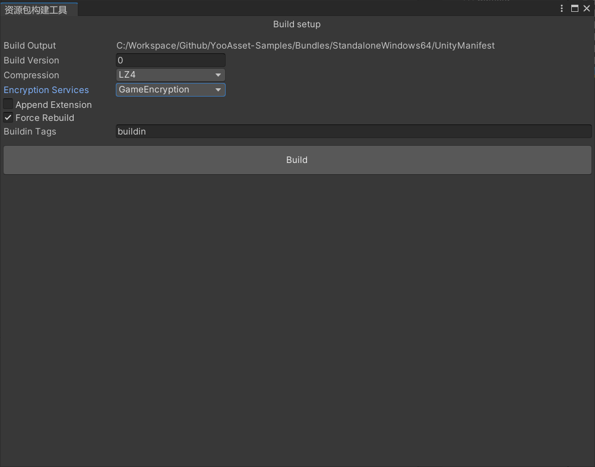
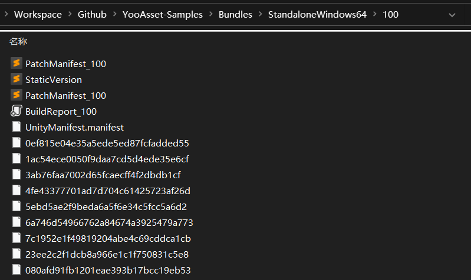
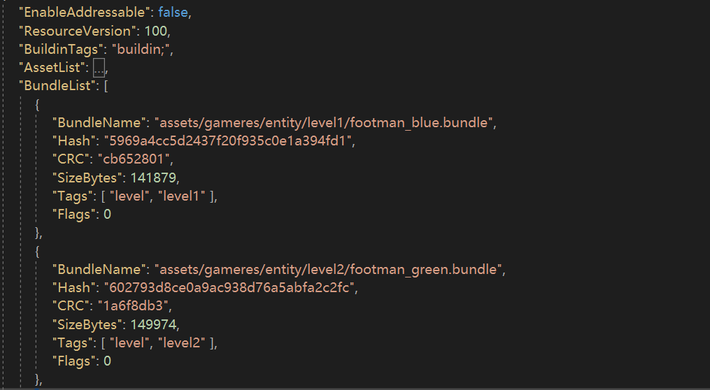

# 资源构建



### 界面介绍

- **Build Output**

  构建输出的目录，会根据Unity编辑器当前切换的平台自动划分构建结果。

- **Build Pipeline**

  构建管线

  (1) BuiltinBuildPipeline: 传统的内置构建管线。

  (2) ScriptableBuildPipeline: 可编程构建管线。

- **Build Mode**

  构建模式

  (1) 强制构建模式：会删除指定构建平台下的所有构建记录，重新构建所有资源包。

  (2) 增量构建模式：以上一次构建结果为基础，对于发生变化的资源进行增量构建。

  (3) 演练构建模式：在不生成AssetBundle文件的前提下，进行演练构建并快速生成构建报告和补丁清单。

  (4) 模拟构建模式：在编辑器下配合EditorSimulateMode运行模式，来模拟真实运行的环境。

- **Build Version**

  构建的资源包版本。

- **Build Package**

  构建的资源包名称。

- **Encryption**

  加密类列表。

- **Compression**

  资源包的压缩方式。

- **Output Name Style**

  输出的资源包文件名称样式

  HashName：哈希值

  HashName_Extension：哈希值+后缀名

  HashName_BundleName_Extension：资源包名+哈希值+后缀名

 - **Copy Buildin File Option**

   首包资源文件的拷贝方式

   (1) None：不拷贝任何文件

   (2) ClearAndCopyAll：先清空已有文件，然后拷贝所有文件

   (3) ClearAndCopyByTags：先清空已有文件，然后按照资源标签拷贝文件

   (4) OnlyCopyAll：不清空已有文件，直接拷贝所有文件

   (5) OnlyCopyByTags：不清空已有文件，直接按照资源标签拷贝文件

- **构建**

  点击构建按钮会开始构建流程，构建流程分为多个节点顺序执行，如果某个节点发生错误，会导致构建失败。错误信息可以在控制台查看。

### 补丁包

构建成功后会在输出目录下找到补丁包文件夹，该文件夹名称为本次构建时指定的资源版本号。

补丁包文件夹里包含补丁清单文件，资源包文件，构建报告文件等。



### 补丁清单

补丁清单是一个Json格式的文本文件。

AssetList组记录的是主资源对象列表。

BundleList组记录的是资源包列表。



### Jenkins支持

如果需要自动化构建，可以参考如下代码范例：

使用内置构建管线来构建资源包。

````c#
private static void BuildInternal(BuildTarget buildTarget)
{
    Debug.Log($"开始构建 : {buildTarget}");

    // 构建参数
    string defaultOutputRoot = AssetBundleBuilderHelper.GetDefaultOutputRoot();
    BuildParameters buildParameters = new BuildParameters();
    buildParameters.OutputRoot = defaultOutputRoot;
    buildParameters.BuildTarget = buildTarget;
    buildParameters.BuildPipeline = EBuildPipeline.BuiltinBuildPipeline;
    buildParameters.BuildMode = EBuildMode.ForceRebuild;
    buildParameters.PackageName = "DefaultPackage";
    buildParameters.PackageVersion = "1.0.0";
    buildParameters.VerifyBuildingResult = true;
    buildParameters.CompressOption = ECompressOption.LZ4;
    buildParameters.OutputNameStyle = EOutputNameStyle.HashName_Extension;
    buildParameters.CopyBuildinFileOption = ECopyBuildinFileOption.None;
    
    // 执行构建
    AssetBundleBuilder builder = new AssetBundleBuilder();
    var buildResult = builder.Run(buildParameters);
    if (buildResult.Success)
    {
         Debug.Log($"构建成功 : {buildResult.OutputPackageDirectory}");
    }
}

// 从构建命令里获取参数示例
private static string GetBuildPackageName()
{
    foreach (string arg in System.Environment.GetCommandLineArgs())
    {
        if (arg.StartsWith("buildPackage"))
            return arg.Split("="[0])[1];
    }
    return string.Empty;
}
````

### 重要概念

- **增量构建**

  增量构建是在Unity的帮助下实现的一种快速打包机制。主要是利用资源构建相关的缓存文件来避免二次构建，以此来提高打包效率。

- **强制构建**

  强制构建是每次构建之前，都会清空之前构建的所有缓存文件，以此来重新构建资源包。

- **首包资源**

  在构建应用程序的时候，我们希望将某些资源打进首包里，首包资源拷贝至StreamingAssets/BuildinFiles/目录下。首包资源如果发生变化，也可以通过热更新来更新资源。

- **补丁包**

  无论是通过增量构建还是强制构建，在构建完成后都会生成一个以包裹版本（PackageVersion）命名的文件夹，我们把这个文件夹统称为补丁包。补丁包里包含了游戏运行需要的所有资源，我们可以无脑的将补丁包内容覆盖到CDN目录下，也可以通过编写差异分析工具，来筛选出和线上最新版本之间的差异文件，然后将差异文件上传到CDN目录里。
