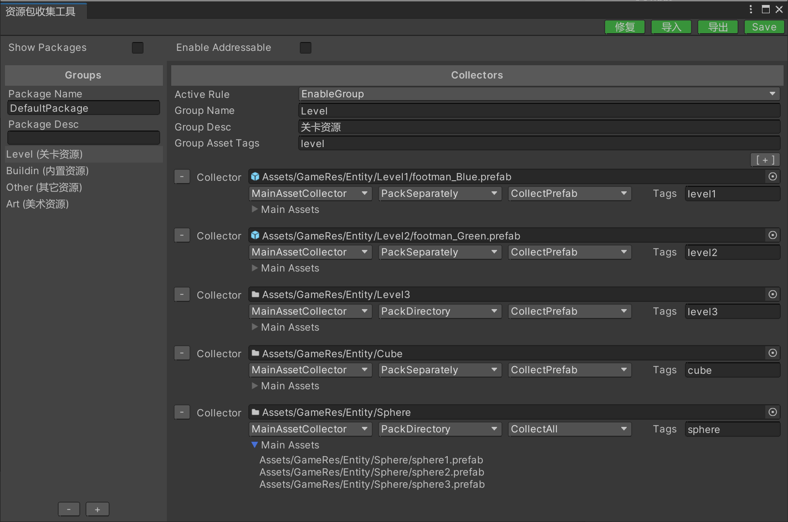

# 资源收集



左侧为分组列表，右侧为该分组的配置界面。

导出按钮可以将配置数据导出为XML文件，导入按钮可以导入保存的XML文件。

**注意**：该工具仅支持Unity2019.4+

#### 公共设置

- Show Packages

  是否展示资源包列表视图。
  
- Enable Addressable

  启用可寻址资源定位系统。
  
- Unique Bundle Name

  资源包名追加PackageName作为前缀。

#### 资源分组

- Active Rule

  激活规则，规则可以自定义扩展。下面是内置规则：

  - EnableGroup 启用分组。

  - DisableGroup 禁用分组。

  ````c#
  //自定义扩展范例
  public class DisableGroup : IActiveRule
  {
    public bool IsActiveGroup()
    {
      return false;
    }
  }
  ````

- Grouper Name

  分组名称

- Grouper Desc

  分组备注信息

- Asset Tags

  资源分类标签列表，该分组下收集的资源会全部被打上该标签。

  注意：多个标签用分号隔开，例如 level1;level2;level3

#### 资源搜集器

- **Collect Path**

  收集路径，可以指定文件夹或单个资源文件。

- **Collector Type**

  收集器类型：

  - MainAssetCollector 收集参与打包的主资源对象，并写入到资源清单的资源列表里（可以通过代码加载）。
  - StaticAssetCollector 收集参与打包的主资源对象，但不写入到资源清单的资源列表里（无法通过代码加载）。
  - DependAssetCollector 收集参与打包的依赖资源对象，但不写入到资源清单的资源列表里（无法通过代码加载）（当依赖资源没有被任何主资源引用的时候，则会在打包的时候自动剔除）。
  
  StaticAssetCollector收集器和DependAssetCollector收集器适合对资源进行定制化打包策略。
  
  示例1：一个游戏的粒子特效的纹理会非常多，通常特效制作师会把这些纹理放到一个文件夹内管理。如果我们把这些纹理打进一个AssetBundle文件内，当下次更新的时候，如果新增或改动了一个纹理，那么就要上传整个纹理的AssetBundle文件。我们可以把特效纹理通过DependAssetCollector收集器进行收集并自定义打包规则，通过文件名称的首字母进行小粒度打包，这样一个AssetBundle文件会被拆分为26个AssetBundle文件。
  
  示例2：当我们需要严格控制某个文件夹内的依赖资源打进同一个AssetBundle文件内，那么StaticAssetCollector收集器是最佳选择，该收集器收集的资源，无论是否被其它资源引用或被多个资源引用，这些资源都会按照设定的打包规则打包，且这些资源不会被处理为share资源包。
  
- **AddressRule**

  可寻址规则，规则可以自定义扩展。下面是内置规则：

  - AddressByFileName 以文件名为定位地址。

  - AddressByGrouperAndFileName 以分组名称+文件名为定位地址。

  - AddressByCollectorAndFileName 以收集器名+文件名为定位地址。

  ````c#
  //自定义扩展范例
  public class AddressByFileName : IAddressRule
  {
    string IAddressRule.GetAssetAddress(AddressRuleData data)
    {
      return Path.GetFileNameWithoutExtension(data.AssetPath);
    }
  }
  ````

- **PackRule**

  打包规则，规则可以自定义扩展。下面是内置规则：

  - PackSeparately 以收集文件路径作为资源包名，每个资源文件单独打包。
  - PackDirectory 以收集文件所在的文件夹路径作为资源包名，该文件夹下所有文件打进一个资源包。
  - PackTopDirectory 以收集器路径下顶级文件夹为资源包名，该文件夹下所有文件打进一个资源包。
  - PackCollector 以收集器路径作为资源包名，收集的所有文件打进一个资源包。
  - PackGrouper 以分组名称作为资源包名，收集的所有文件打进一个资源包。
  - PackRawFile 目录下的资源文件会被处理为原生资源包。

  ````c#
  //自定义扩展范例
  public class PackDirectory : IPackRule
  {
    string IPackRule.GetBundleName(PackRuleData data)
    {
      return Path.GetDirectoryName(data.AssetPath); //"Assets/Config/test.txt" --> "Assets/Config"
    }
  }
  ````

- **FilterRule**

  过滤规则，规则可以自定义扩展。下面是内置规则：

  - CollectAll 收集目录下的所有资源文件
  - CollectScene 只收集目录下的场景文件
  - CollectPrefab 只收集目录下的预制体文件
  - CollectSprite 只收集目录下的精灵类型的文件

  ````c#
  //自定义扩展范例
  public class CollectScene : IFilterRule
  {
    public bool IsCollectAsset(FilterRuleData data)
    {
      return Path.GetExtension(data.AssetPath) == ".unity";
    }
  }
  ````

- **AssetTags**

  资源分类标签列表，该收集器下收集的资源会全部被打上该标签。

