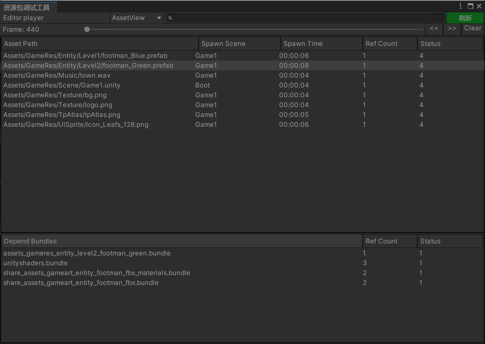
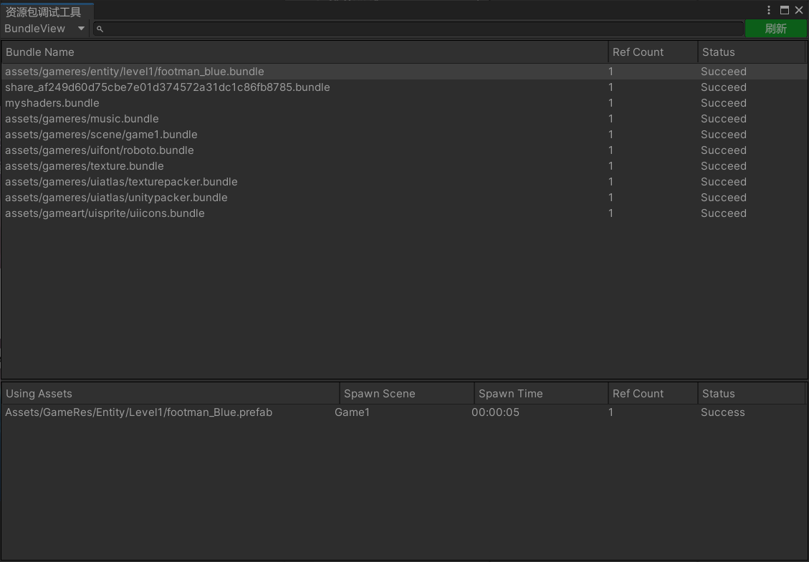

# 调试器

调试器是在游戏运行时，帮助我们查看资源包加载信息的工具，通过该工具可以发现潜在的资源泄漏。

可以查看资源对象列表信息（AssetView），资源包列表信息（BundleView）。

**注意**：该工具仅支持Unity2019.4+

### 真机远程调试注意事项

在构建安装包的时候，需要勾选上Development Build和Autoconnect Profiler

### 资源对象列表视图

### 资源包列表视图

