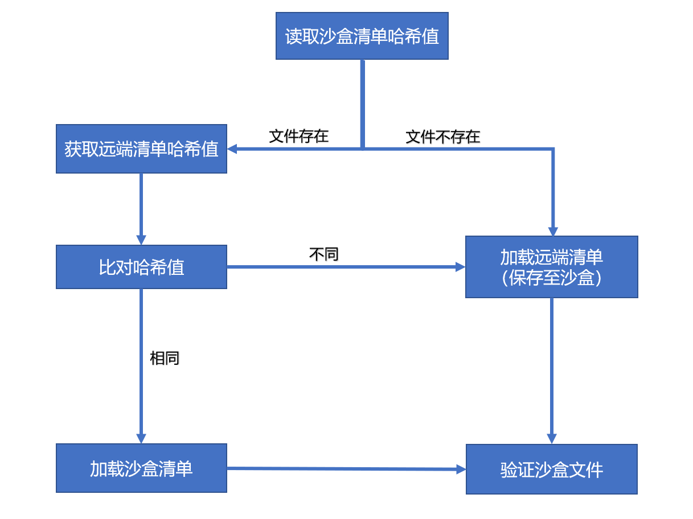

# 资源更新

**获取资源版本**

对于联机运行模式，在更新补丁清单之前，需要获取一个资源版本。

该资源版本可以通过YooAssets提供的接口来更新，也可以通过HTTP访问游戏服务器来获取。

````c#
private IEnumerator UpdateStaticVersion()
{
    var package = YooAssets.GetAssetsPackage("DefaultPackage");
    var operation = package.UpdatePackageVersionAsync();
    yield return operation;

    if (operation.Status == EOperationStatus.Succeed)
    {
        //更新成功
        string PackageVersion = operation.PackageVersion;
        Debug.Log($"Updated package Version : {PackageVersion}");
    }
    else
    {
        //更新失败
        Debug.LogError(operation.Error);
    }
}
````

**更新补丁清单**

对于联机运行模式，在获取到资源版本号之后，就可以更新资源清单了。

````c#
private IEnumerator UpdatePatchManifest()
{
    var package = YooAssets.GetAssetsPackage("DefaultPackage");
    var operation = package.UpdatePackageManifestAsync(packageVersion);
    yield return operation;

    if (operation.Status == EOperationStatus.Succeed)
    {
        //更新成功
    }
    else
    {
        //更新失败
        Debug.LogError(operation.Error);
    }
}
````

**补丁包下载**

在补丁清单更新完毕后，就可以更新资源文件了。

根据产品需求，可以选择更新全部资源，或者只更新部分资源。

补丁包下载接口：

- YooAssets.CreatePatchDownloader(int downloadingMaxNumber, int failedTryAgain, int timeout)

  用于下载更新当前资源版本所有的资源包文件。

- YooAssets.CreatePatchDownloader(string[] tags, int downloadingMaxNumber, int failedTryAgain, int timeout)

  用于下载更新资源标签指定的资源包文件。

- YooAssets.CreateBundleDownloader(string[] locations, int downloadingMaxNumber, int failedTryAgain, int timeout)

  用于下载更新指定的资源列表依赖的资源包文件。

````c#
IEnumerator Download()
{
    int downloadingMaxNum = 10;
    int failedTryAgain = 3;
    int timeout = 60;
    var package = YooAssets.GetAssetsPackage("DefaultPackage");
    var downloader = package.CreatePatchDownloader(downloadingMaxNum, failedTryAgain, timeout);
    
    //没有需要下载的资源
    if (downloader.TotalDownloadCount == 0)
    {        
        yield break;
    }

    //需要下载的文件总数和总大小
    int totalDownloadCount = downloader.TotalDownloadCount;
    long totalDownloadBytes = downloader.TotalDownloadBytes;    

    //注册回调方法
    downloader.OnDownloadErrorCallback = OnDownloadErrorFunction;
    downloader.OnDownloadProgressCallback = OnDownloadProgressUpdateFunction;
    downloader.OnDownloadOverCallback = OnDownloadOverFunction;
    downloader.OnStartDownloadFileCallback = OnStartDownloadFileFunction;

    //开启下载
    downloader.BeginDownload();
    yield return downloader;

    //检测下载结果
    if (downloader.Status == EOperationStatus.Succeed)
    {
        //下载成功
    }
    else
    {
        //下载失败
    }
}
````

**弱联网环境解决方案**

对于偏单机但是也有资源热更需求的项目。当玩家在无网络的时候，我们又不希望玩家卡在资源更新步骤而不能正常游戏。所以当玩家本地网络有问题的时候，我们可以跳过资源更新的步骤。

````c#
private IEnumerator Start()
{
    var package = YooAssets.GetAssetsPackage("DefaultPackage");
    var operation = package.UpdatePackageVersionAsync(30);
    yield return operation;
    if (operation.Status == EOperationStatus.Succeed)
    {
        // 如果获取远端资源版本成功，说明当前网络连接通畅，可以走正常更新流程。
        ......
    }
    else
    {
        // 如果获取远端资源版本失败，说明当前网络无连接。
        // 在正常开始游戏之前，需要验证本地清单内容的完整性。
        string packageVersion = package.GetPackageVersion();
        var operation = package.CheckPackageContentsAsync(packageVersion);
        yield return operation;
        if (operation.Status == EOperationStatus.Succeed)
        {
            StartGame();
        }
        else
        {
            // 资源内容本地并不完整，需要提示玩家联网更新。
            ShowMessageBox("请检查本地网络，有新的游戏内容需要更新！");
        }
    }
}
````

### 源代码解析

- 联机运行模式

  UpdatePackageManifestAsync()为资源清单更新方法。该方法的内部实现原理如下：

  
