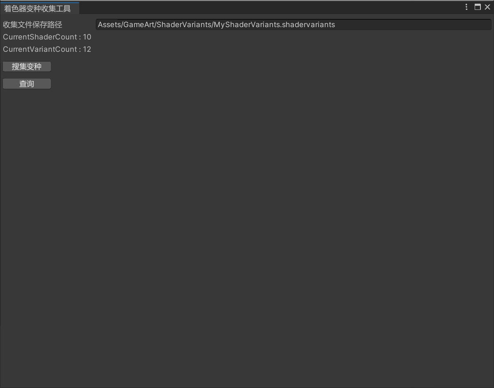

# 着色器变种收集



点击搜集变种按钮开始收集，请耐心等待结束。

### Jenkins支持

```c#
public static void CollectSVC()
{
    string savePath = ShaderVariantCollectorSettingData.Setting.SavePath;  
    System.Action completedCallback = () =>
    {
        ShaderVariantCollection collection =
            AssetDatabase.LoadAssetAtPath<ShaderVariantCollection>(savePath);
        if (collection != null)
        {
            Debug.Log($"ShaderCount : {collection.shaderCount}");
            Debug.Log($"VariantCount : {collection.variantCount}");
        }
        else
        {
            throw new Exception("Failed to Collect shader Variants.");
        }
        
        EditorTools.CloseUnityGameWindow();
        EditorApplication.Exit(0);
    };
    ShaderVariantCollector.Run(savePath, completedCallback);
}
```

```c#
// 命令行调用
%Projects_UnityEngine_Path% -batchmode -projectPath %Projects_UnityProject_Path% -executeMethod ET.CIHelper.CollectSVC -logFile %Projects_UnityProject_Path%/Logs/CIBuildSVC.log
```
